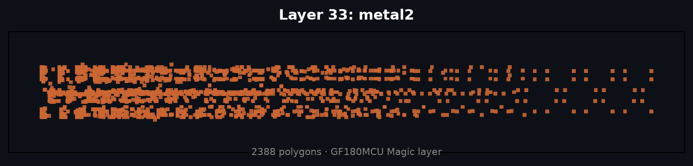
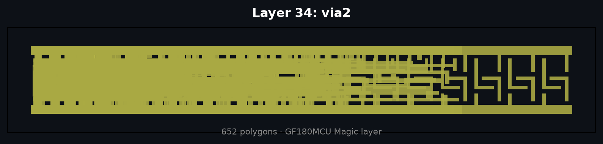
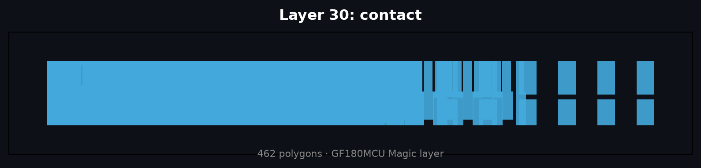
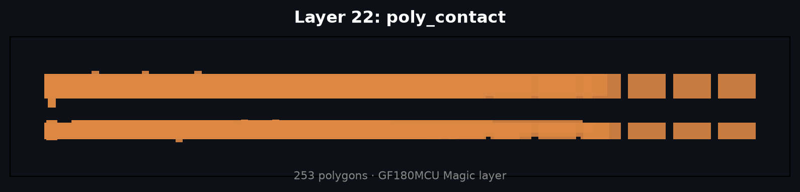
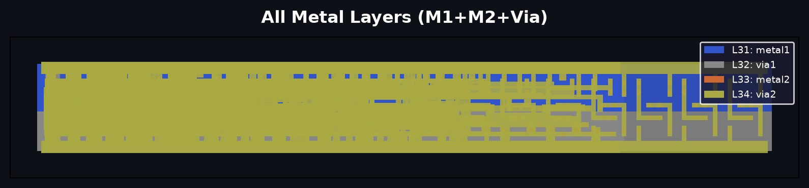
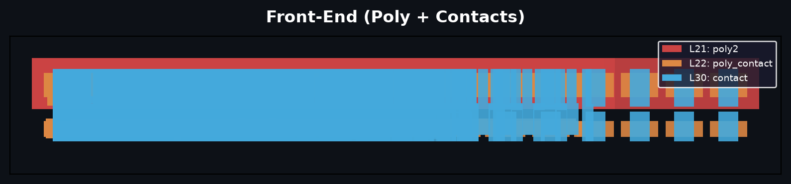
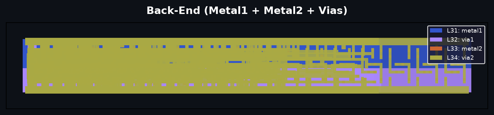
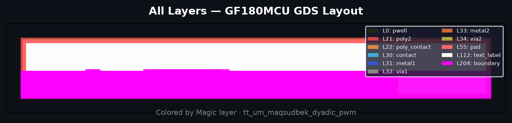
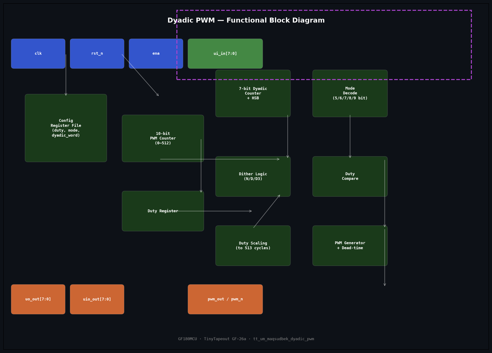
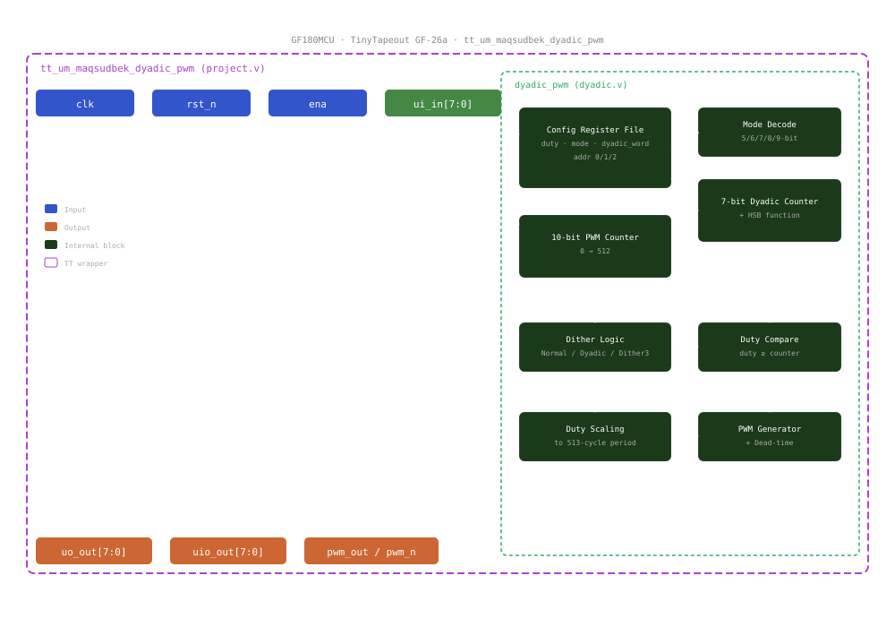

# Dyadic PWM — Chip Design Renders

Generated programmatically from the hardened GF180MCU GDS, Verilog RTL, and simulation data.
All outputs are self-contained in this `pics/` directory. No project source files were modified.

**Design:** `tt_um_maqsudbek_dyadic_pwm` · **Shuttle:** TinyTapeout GF-26a · **PDK:** GF180MCU (180nm)  
**Tile:** 1×1 · **Utilization:** 45.5% · **Fmax (typical):** 50 MHz · **All-corner Fmax:** ~30 MHz

---

## 📐 Physical Layout (GDS)

### Per-Layer Views (most useful for understanding the design)

| Layer | Image | Description |
|-------|-------|-------------|
| **33 — Metal2** | [](files/layout-layer-33-metal2.png) | Primary routing layer (2,388 polygons). Most visible structural view. |
| **34 — Via2** | [](files/layout-layer-34-via2.png) | M1→M2 vias (652 polygons). Shows connection density. |
| **31 — Metal1** | [](files/layout-layer-31-metal1.png) | Base metal routing (87 polygons). |
| **30 — Contact** | [](files/layout-layer-30-contact.png) | Poly→M1 contacts (462 polygons). Transistor connections. |
| **22 — Poly Contact** | [](files/layout-layer-22-poly_contact.png) | Poly layer contacts (253 polygons). |
| **21 — Poly2** | [](files/layout-layer-21-poly2.png) | Transistor gates (85 polygons). The active devices. |

### Composite Views

| Group | Image | Description |
|-------|-------|-------------|
| **All Metal** | [](files/layout-group-metal-all.png) | Metal1 + Via1 + Metal2 + Via2 combined |
| **Front-End** | [](files/layout-group-frontend.png) | Poly2 + Poly Contact + Contact — transistor-level view |
| **Back-End** | [](files/layout-group-backend.png) | Metal1 + Metal2 + Vias — routing stack |
| **All Layers** | [](files/layout-all-layers.png) | Every layer overlaid with legend |

### Legacy Renders

| File | Description |
|------|-------------|
| [layout-gds.png](files/layout-gds.png) | CI-generated GDS render (from GitHub Actions) |
| [layout-gds.svg](files/layout-gds.svg) | Vector GDS render (gdstk) |
| [layout-gds-colored.png](files/layout-gds-colored.png) | Early colored render (all layers) |
| [layout-gds-detail.png](files/layout-gds-detail.png) | Zoomed-in die center detail |

---

## 🧠 RTL Schematics

Generated by **Yosys 0.23** `show` command → Graphviz `dot`.

| Schematic | Image | Description |
|-----------|-------|-------------|
| **dyadic_pwm (raw)** | [](files/rtl-dyadic-raw.png) | [SVG](files/rtl-dyadic-raw.svg) · Full detail, every gate and wire |
| **dyadic_pwm (simplified)** | [](files/rtl-dyadic-simple.png) | [SVG](files/rtl-dyadic-simple.svg) · Flattened + optimized view |
| **tt_um_ wrapper** | [](files/rtl-top.png) | [SVG](files/rtl-top.svg) · Top-level wrapper with I/O pads |

---

## 🔬 Gate-Level Schematic

Post-synthesis netlist rendered through Yosys. Shows the GF180MCU standard-cell implementation.

| Schematic | Image | Description |
|-----------|-------|-------------|
| **Gate-Level** | [](files/gate-schematic.png) | [SVG](files/gate-schematic.svg) · Post-synthesis netlist (874 cells) |

> **Note:** Post-layout netlist (2,252 instances) is too large for Graphviz rendering — the `.dot` file is available at [gate-schematic-pnl.dot](files/gate-schematic-pnl.dot) for alternative viewers.

---

## 📊 Block / Functional Diagrams

| Method | Image | Description |
|--------|-------|-------------|
| **Mermaid** | [](files/block-diagram-mermaid.png) | Auto-rendered from Mermaid DSL via mermaid.ink |
| **Matplotlib** | [](files/block-diagram-mpl.png) | Python/matplotlib boxes-and-arrows |
| **Hand SVG** | [](files/block-diagram.svg) | Hand-crafted SVG with legend |

[block-diagram-mermaid.mmd](files/block-diagram-mermaid.mmd) — Mermaid source (editable).

---

## 📈 Simulation Waveform

| File | Description |
|------|-------------|
| [waveform.png](files/waveform.png) | Simulation waveform plot (clk, pwm_out, duty signals) |

To view the full interactive waveform with all signals:
```bash
cd ../test && gtkwave tb.fst
```
A pre-configured GTKWave save file is at `../test/tb.gtkw`.

---

## 🛠 Generation Scripts (reproducible)

| Script | Purpose |
|--------|---------|
| [render_gds.py](render_gds.py) | GDS → SVG + colored PNG + detail zoom |
| [render_gds_layers.py](render_gds_layers.py) | GDS → per-layer + grouped renders |
| [render_blocks.py](render_blocks.py) | Block diagrams (all 3 methods) |
| [make_waveform.py](make_waveform.py) | Waveform plot from simulation data |
| [export_waveform.tcl](export_waveform.tcl) | GTKWave Tcl export attempt |

To regenerate everything:
```bash
pics/.venv/bin/python pics/render_gds_layers.py   # layout renders
pics/.venv/bin/python pics/render_blocks.py       # block diagrams
pics/.venv/bin/python pics/make_waveform.py       # waveform
# RTL schematics (requires yosys + graphviz):
yosys -p "read_verilog src/project.v src/dyadic.v; prep -top dyadic_pwm; show -format png -prefix pics/rtl-dyadic-raw -notitle"
yosys -p "read_verilog src/project.v src/dyadic.v; hierarchy -top dyadic_pwm; proc; flatten; opt; clean; show -format png -prefix pics/rtl-dyadic-simple -notitle"
```

---

## 📋 Key Specs Summary

| Parameter | Value |
|-----------|-------|
| **Technology** | GF180MCU (180nm) |
| **Tile** | 1×1 (smallest TinyTapeout slot) |
| **Die area** | 36.7 × 4.8 µm |
| **Cell instances** | 2,252 (post-layout) |
| **Utilization** | 45.5% |
| **Max clock (typ)** | 50 MHz |
| **All-corner Fmax** | ~30 MHz |
| **PWM modes** | Normal, Dyadic, 3× Dither (5/6/7/8/9-bit) |
| **Interface** | 34-pin TT standard (ui_in, uo_out, uio, clk, rst_n, ena) |
| **Test status** | 10/10 cocotb tests passing |

---

*Generated 2026-06-25 · Tools: Yosys 0.23, Graphviz 2.43, gdstk 1.0.0, CairoSVG 2.9, matplotlib 3.11*
